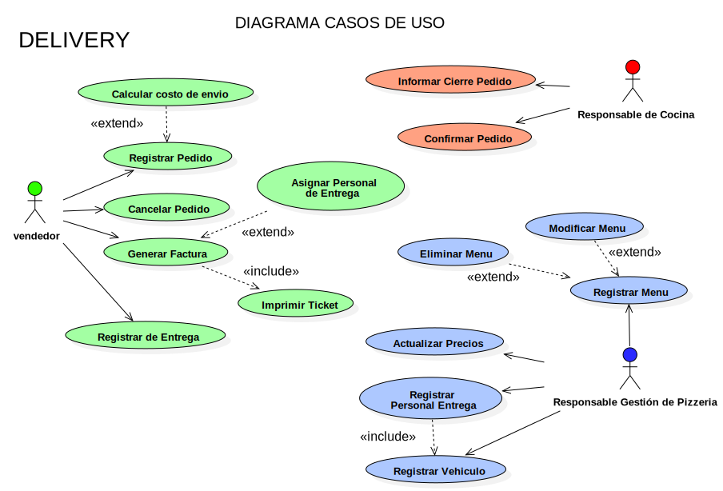

# PROYECTO DELIVERY - PLAN 111MIL

## Introducción

En el siguiente documento se desarrolla las características esenciales de un sistema de información correspondiente al dominio de Caso Práctico Nº2 - Pizzeria en el marco del Plan111.
Estas características comprenden la definición de los objetivos, límites, alcances del sistema, los procesos que se llevan a cabo dentro del mismo, su arquitectura de software, tecnologías aplicadas en el desarrollo, definición de la estructuras de la base de datos a través del diagrama de entidad-relación y la diagramación del modelo del sistema en lenguaje de modelo unificado (UML).
Para la obtención de datos necesarios se utilizó el dominio de negocio aportado por el Plan111 como base añadiendo el proceso de Delivery.

## Desarrollo

### Procesos que se llevan a cabo

El sistema prestará soporte a los siguientes procesos que se llevan a cabo dentro de la organización:

* Pedido: Cada pedido es generado por el cliente cuando éste los solicita teniendo a disposición un menú que describe para cada uno la variedad, nombre, ingredientes, precio y tipo de pizza que desee. Luego de que el cliente realiza la elección se despacha el pedido hacia la cocina, previamente registrado cliente, menues elegidos y fecha. Además se notifica al cliente la demora estimada del pedido.

* Confección de Menú: La confección del menú para ofrecer a los clientes se establecen en base al tipo de pizza, la variedad y tamaño de la misma.

* Envíos a domicilio (Delivery): En el supuesto que el cliente que se le entregue el pedido a domicilio, se le solicite que aporte su domicilio y número de teléfono para realizar la entrega.

## Límite

### El límite de este sistema es:

Desde la confección de menues y pedido realizado por el cliente, hasta la emisión de informes con la información de las recaudaciones variedades y tipos de pizzas más solicitados y pedidos solicitados, junto con las zonas o barrios donde se realizan más entregas y tiempos de entregas.

## Propiedades del sistema.

Objetivos: brindar soporte en la gestión de los pedidos de la Pizzería. Proveer información de los procesos que abarca.

### Alcances

* Atender la consulta del cliente (telefónica o personal) por el empleado.

* Buscar el/los menues que el cliente solicita por el empleado.

* Si el cliente esta dentro del local, entregar el/los menues al cliente por el empleado.

* Gestionar Registrar el pedido.

* Si el pedido fue solicitado con entrega a domicilio, cargar el mismo en el vehiculo de deliveri por el empleado.

* Asignar el pedido a un PersonaldeEntrega para que se realize la entrega.

* Registrar los menues que se ofrecen a los clientes.
Realizar informes con la información solicitada por el dueño de la organización.

* Registrar datos del Personal de Entrega junto con sus vehiculos.

* Registrar datos del cliente (se usara el telefono como identificacion principal), con domicilio detallando ciudad, barrio, calle y altura.

* El sistema debera ofrecer una hoja de ruta recomendada para entregarle o sugerirle al Personal de entrega y asi optimizar tiempo y calidad de servicio.

## Arquitectura de Software
Se define una arquitectura cliente-servidor desktop – arquitectura en capas.

### Aplicación:

Se utiliza el patrón para organizar la implementación de este sistema complejo en capas de servicios auto contenidas, para logar un sistema mantenible, de bajo acoplamiento, adaptable y escalable. 

* Capa de presentación: `Vista Desktop`

* Capa de Lógica de Negocios: `Controladores`

* Capa de persistencia: `ORM - Hibernate`

### Motivaciones:

Reutilización de servicios brindados por la interfaz brindada por cada capa. Mejorar la portabilidad. Los cambios de hardware, del sistema operativo y todo lo que afecta solamente a una capa, se pueden modificar sin alterar al resto de las capas.

## Tecnologías Aplicadas

* Lenguaje de Desarrollo: [Java con JDK versión 8.0](http://www.oracle.com/technetwork/java/javase/downloads/jdk8-downloads-2133151.html)

* Entorno de desarrollo: 
  * [Netbeans IDE versión 8.2](http://www.oracle.com/technetwork/es/java/javase/downloads/jdk-netbeans-jsp-3413139-esa.html)
  * [Intellij IDEA 2018](https://www.jetbrains.com/idea/)

* ORM: [Hibernate versión 5.2](http://hibernate.org/orm/)

* Sistema gestor de base de datos: [MySQL versión 8.0](https://dev.mysql.com/downloads/windows/)

* Modelado del sistema: UML versión 2.0 [StarUML](http://staruml.io/)

* Sistema de Control de Versiones: [Git](https://git-scm.com/)

* Gestor de Repositorios: [Github Desktop](https://desktop.github.com/)

* Generación de reportes: [Jasper Reports - Ireport Versión 5.2](https://community.jaspersoft.com/download)

* Project Object Model (POM): [Maven](https://maven.apache.org/)

## Diagrama de Entidad-Relación (DER)

## Diagrama de Clases (UML)

## Diagrama Casos de Usos (Use Case)

 
## Historial de revisiones

|Control de Versionado  |                           |
|-----------------------|---------------------------|
|Fecha de Creación:     | 15/04/2018                |
|Última Modificación:   | 25/04/2018                |
|Versión Actual:        | 1.3                       |
|Equipo de trabajo:     | Araceli, Ramiro, Nicolás  |