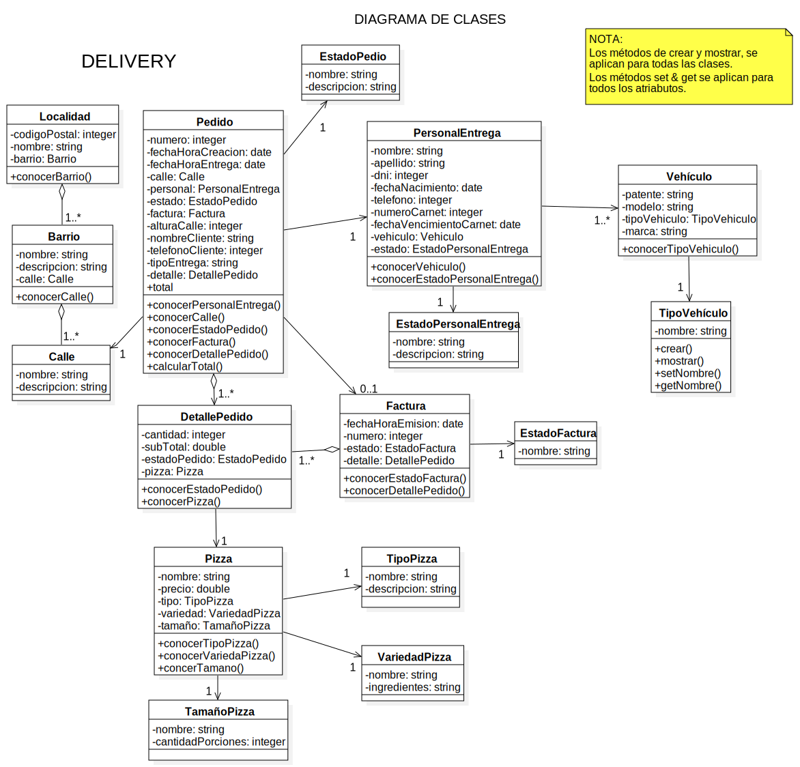
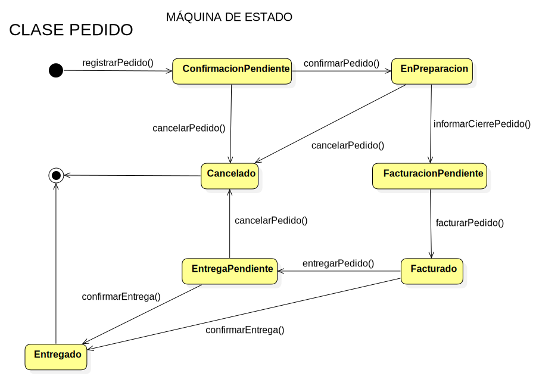
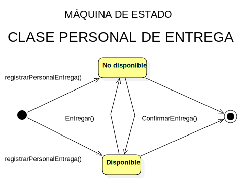
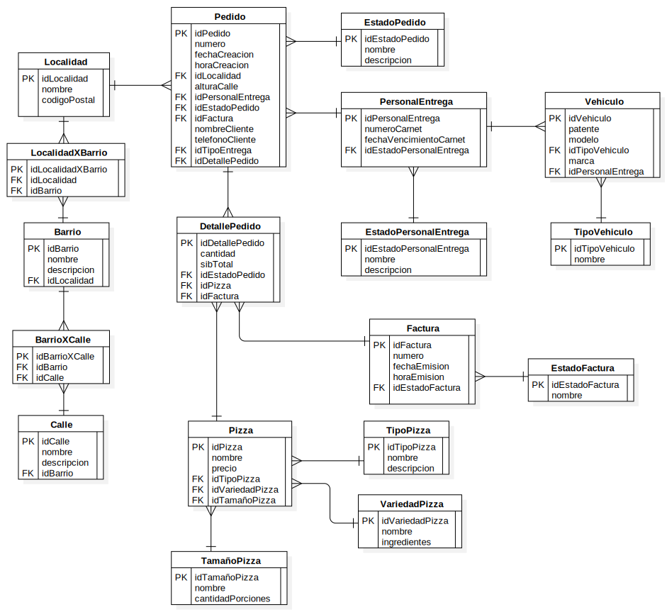

# PROYECTO DELIVERY - PLAN 111MIL

## INTRODUCCIÓN

En el siguiente documento se desarrolla las características esenciales de un sistema de información correspondiente al dominio de Caso Práctico Nº2 - Pizzeria en el marco del Plan111. 

Estas características comprenden la definición de los [objetivos](#objetivos), [límites](#limite), [alcances del sistema](#alcances), los [procesos que se llevan a cabo](#procesos-que-se-llevan-a-cabo) dentro del mismo, su [arquitectura de software](#arquitectura-de-software), [tecnologías aplicadas](#tecnologias-aplicadas) en el desarrollo, definición de la estructuras de la base de datos a través del [diagrama de entidad-relación](#diagrama-de-entidad-relacion-der), la [diagramación del modelo](#diagrama-de-clases-uml) del sistema en lenguaje de modelado unificado (UML), [diagrama de casos de uso](#diagrama-casos-de-usos-use-case) y [máquina de estado](#).
Para la obtención de datos necesarios se utilizó el dominio de negocio aportado por el Plan111 como base añadiendo el proceso de Delivery.

### Dominio

A continuación se detalla el enunciado para conocer el dominio con el cual se trabajará.

Una `pizzería` de la ciudad ofrece a sus clientes una amplia `variedad de pizzas` de fabricación propia, de `varios tamaños (8, 10 y 12 porciones)`. Los clientes tienen a disposición un menú que describe para cada una de las `variedades`, el `nombre`, los `ingredientes` y el `precio` según el `tamaño` y el `tipo (a la piedra, a la parrilla, de molde)` de la `pizza`. Los clientes realizan sus pedidos en el mostrador o por teléfono.

El `pedido` debe contener el `nombre del cliente`, para llamarlo cuando su pedido está listo; la `cantidad de pizzas`, el `tamaño`, la `variedad`, la `fecha del pedido` y la `demora estimada` informada al cliente.

El pedido va a la cocina y cuando está preparado se informa al que lo tomó para que se genere la `factura` correspondiente y se le entregue el pedido al cliente.

Esta empresa también cuenta con el servicio de delivery, cuando se toma dicho pedido (puede ser telefónico) deberán solicitarse datos extras como `direccion` y `número de teléfono`. Con los datos solicitados, el pedido será entregado al `personal de entrega` para poder efectuar la entrega requerida por el cliente.

El dueño de la pizzería ha manifestado la necesidad de acceder al menos a la siguiente información:

* Variedades y tipos de pizzas más pedidas por los clientes.
* Ingresos (recaudaciones) por períodos de tiempo.
* Pedidos (cantidad y monto) por períodos de tiempo.
* Barrios donde más se realizan entregas de pedidos.
* Entregar hoja de ruta al personal de entrega.

## DESARROLLO

### Procesos que se llevan a cabo

El sistema prestará soporte a los siguientes procesos que se llevan a cabo dentro de la organización:

* **Pedido**: Cada pedido es generado por el cliente cuando éste los solicita teniendo a disposición un menú que describe para cada uno la variedad, nombre, ingredientes, precio y tipo de pizza que desee. Luego de que el cliente realiza la elección se despacha el pedido hacia la cocina, con datos del cliente y del pedido. Además se notifica al cliente la demora estimada del pedido.

* **Confección de Menú**: La confección del menú para ofrecer a los clientes se establecen en base al tipo de pizza, la variedad y tamaño de la misma.

* **Envíos a domicilio (Delivery)**: En el supuesto que la entrega del pedido sea a domicilio, se le pedirá al cliente que informe su domicilio y número de teléfono para realizar la entrega. Se deberá tener en cuenta que el personal de entrega podrá llevar más de un pedido por viaje. El coste de este envío estará determinado por medio de un cálculo según la distancia que se encuentre el domicilio del negocio con respecto a la del cliente.

## LÍMITE

### El límite de este sistema es:

Desde la confección de menues, pedidos, registros de personal hasta la emisión de informes con la información requerida por el dueño.

## PROPIEDADES DEL SISTEMA

### Objetivos

* Brindar soporte en la gestión de los pedidos de la Pizzería. 
* Proveer información de los procesos que abarca.

### Requerimientos

* Atender la consulta del cliente (telefónica o personal) por el empleado.

* Buscar el/los menues que el cliente solicita por el empleado.

* Si el cliente esta dentro del local, deberá entregar el/los menues al cliente por el empleado.

* El empleado toma los datos del pedido al cliente.

* Si el pedido fue solicitado con entrega a domicilio, estimar el costo de envio con los datos aportados por el cliente.

### Alcances

* Registrar los menues que se ofrecen a los clientes.

* Registrar datos del Personal de Entrega junto con sus vehiculos.

* Gestionar el pedido desde su registro hasta la entrega.

* Asignar el pedido a un PersonaldeEntrega para que se realize la entrega.

* Realizar informes con la información solicitada por el dueño de la organización.

* El sistema debera ofrecer una hoja de ruta recomendada para entregarle o sugerirle al personal de entrega y asi optimizar tiempo y calidad de servicio.

## ARQUITECTURA DE SOFTWARE

Se define una arquitectura `CLIENTE - SERVIDOR` desktop – arquitectura en capas.

### Aplicación:

Se utiliza el patrón para organizar la implementación de este sistema complejo en capas de servicios auto contenidas, para logar un sistema mantenible, de bajo acoplamiento, adaptable y escalable. Mejorando la portabilidad, los cambios de hardware, del sistema operativo y todo lo que afecta solamente a una capa, se pueden modificar sin alterar al resto de las capas.

::: tip CAPA DE PRESENTACIÓN
Vista Desktop
:::

::: tip CAPA LÓGICA DE NEGOCIOS
Controladores
:::

::: tip CAPA DE PERSISTENCIA
ORM - Hibernate
:::

## TECNOLOGÍAS APLICADAS

* Lenguaje de Desarrollo: [Java con JDK versión 8.0](http://www.oracle.com/technetwork/java/javase/downloads/jdk8-downloads-2133151.html)

* Entorno de desarrollo: 
  * [Netbeans IDE versión 8.2](http://www.oracle.com/technetwork/es/java/javase/downloads/jdk-netbeans-jsp-3413139-esa.html)
  * [Intellij IDEA 2018](https://www.jetbrains.com/idea/)

* ORM: [Hibernate versión 5.2](http://hibernate.org/orm/)

* Sistema gestor de base de datos: [MySQL versión 8.0](https://dev.mysql.com/downloads/windows/)

* Modelado del sistema: UML versión 2.0 [StarUML](http://staruml.io/)

* Sistema de Control de Versiones: [Git](https://git-scm.com/)

* Gestor de Repositorios: [Github Desktop](https://desktop.github.com/)

* Generación de reportes: [Jasper Studio versión 6.5](https://community.jaspersoft.com/project/jaspersoft-studio/releases)

* Project Object Model (POM): [Maven](https://maven.apache.org/)

  * [Dependecia Hibernate](https://mvnrepository.com/artifact/org.hibernate/hibernate-core)

  * [Dependecia Hibernate-persistence](https://mvnrepository.com/artifact/org.hibernate.javax.persistence/hibernate-jpa-2.1-api)

  * [Dependecia MySQL connector](https://mvnrepository.com/artifact/mysql/mysql-connector-java)

  * [Dependecia Lombok](https://mvnrepository.com/artifact/org.projectlombok/lombok)

## DIAGRAMA DE CLASES (UML)

## DIAGRAMA CASOS DE USOS (USE CASE)

## DIAGRAMA CASOS DE USOS TRAZO FINO

<caso-de-uso-trazo-fino></caso-de-uso-trazo-fino>

## MÁQUINA DE ESTADO

 
## DIAGRAMA DE ENTIDAD-RELACIÓN (DER)

## HISTORIAL DE VERSIONES

|Control de Versionado  |Datos        |
|-----------------------|-------------|
|Fecha de Creación:     |15/04/2018   |
|Última Modificación:   |13/06/2018   |
|Versión Actual:        |1.18         |

## INTEGRANTES

|Equipos        |Integrantes                                                              |
|---------------|-------------------------------------------------------------------------|
|Profesores     |[Araceli Mendoza](https://www.linkedin.com/in/aracelli-mendoza-8765a549/)|
|               |[Nicolás Oliva](https://github.com/nicolasoliva62)                       | 
|               |Ramiro Bertalot                                                          | 
|Equipo A       |[Guido Cavallo](https://www.linkedin.com/in/cavalloguido/)               |
|               |[Sebastián Cuaglia](https://github.com/sebacuaglia)                      | 
|               |[Ruben Malizia](https://github.com/Malizia27)                            | 
|               |[Pablo Cruciani](https://github.com/PabloCruciani)                       | 
|Equipo B       |[Daniel Rosso](https://github.com/daniel1rosso)                          | 
|               |[Pablo Mansilla](https://github.com/paulmansilla)                        | 
|               |[Federico Boccardo](https://github.com/Feedeac)                          | 
|               |Hernán Grosso                                                            |
